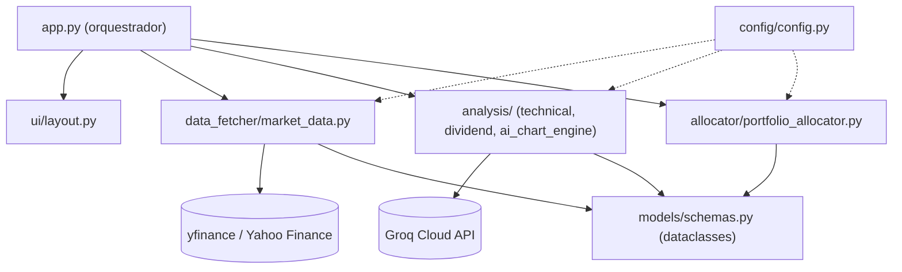
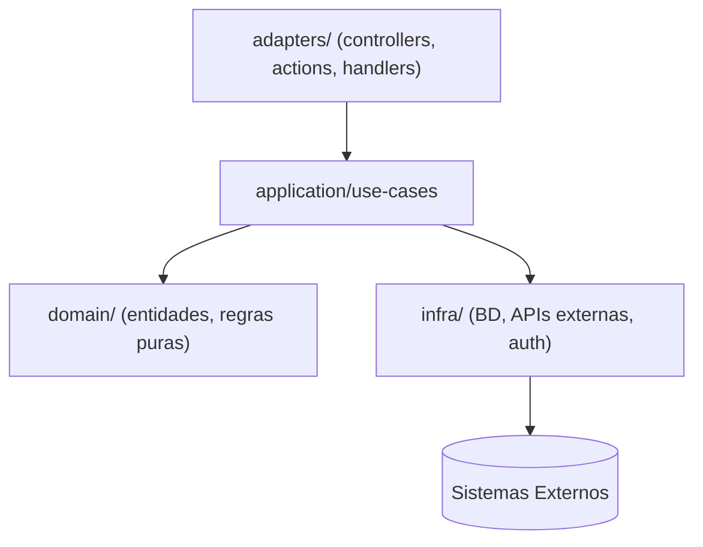

# Guia de Arquitetura

Arquitetura de referência e stack deste workspace. Todo agente deve ler este arquivo antes de tomar uma decisão técnica.

> Detalhes de implementação: `backend-guidelines.md` e `frontend-guidelines.md`.
> Nomenclatura e convenções de código: `conventions.md`.

---

## Stack

Confirmada pelo Architect em 2026-07-19, a partir do código já existente no repositório (ver decisão em `.ai/technical-spec.md` seção 9). Referência vinculante para toda feature seguinte.

| Camada | Tecnologia |
|-------|-----------|
| Linguagem | Python 3.11+ |
| Framework (UI/app) | Streamlit >=1.30,<1.40 |
| Dados de mercado | yfinance (Yahoo Finance, não-oficial) |
| Análise numérica | pandas + pandas-ta (indicadores técnicos) |
| IA generativa | Groq Cloud (SDK `groq`), modelo `llama-3.3-70b-versatile` |
| Banco de dados | Nenhum — app stateless. Cache em memória via `st.cache_data` (TTL 900s) |
| Testes | pytest |
| Lint/Format | ruff |

> `plotly` consta em `requirements.txt` mas não é usado em nenhum módulo (`ui/layout.py` usa `st.bar_chart`). Tratado como débito técnico — ver riscos em `.ai/technical-spec.md`.

---

## Arquitetura Confirmada: Pipeline em Camadas Funcionais (desvio documentado do Clean Architecture padrão)

Este projeto **não segue** o padrão `domain/application/adapters/infra` abaixo (mantido neste arquivo como referência para *outros* projetos deste workspace). Motivo do desvio, registrado em `.ai/technical-spec.md` seção 9:

- App Streamlit de execução única por request (script re-executado a cada interação), sem persistência, sem sessão de usuário além do `st.session_state` em memória, sem autenticação real (só uma senha opcional para liberar a IA).
- O domínio é essencialmente cálculo puro sobre DataFrames — inversão de dependência via interfaces adicionaria camadas sem benefício de teste (os módulos já são testáveis por injeção de função/parâmetro simples).
- Enquadra-se no caso de exceção "CLI ou scripts standalone" da tabela abaixo: overhead de Clean Architecture é injustificado para um pipeline de dados de camada única.

### Estrutura Real

```
├── app.py                      # Orquestrador: entrypoint Streamlit, monta o pipeline, chama a UI
├── config/config.py            # Configuração global (tickers padrão, pesos de estratégia, thresholds, env vars)
├── data_fetcher/market_data.py # Aquisição de dados externos (yfinance), com cache e retry
├── analysis/                   # Cálculo puro sobre dados já coletados
│   ├── technical_analysis.py   #   Indicadores técnicos (pandas-ta)
│   ├── dividend_analysis.py    #   Métricas de dividendos/consistência
│   └── ai_chart_engine.py      #   Interpretação via Groq (IA generativa)
├── allocator/portfolio_allocator.py # Scoring, alocação de capital, plano de rebalanceamento
├── models/schemas.py           # Dataclasses compartilhadas entre todas as camadas (contrato de dados)
└── ui/layout.py                # Componentes de apresentação Streamlit (sidebar, tabelas, gráficos)
```

### Diagrama de Referência (real, deste projeto)



### Regras de Dependência (nunca violar neste projeto)

- `models/schemas.py` → sem imports de outras camadas do projeto (zero dependências internas, só `dataclasses`/`typing`)
- `data_fetcher/` e `analysis/` → não importam `ui/`. Podem importar `models/` e `config/`
- `allocator/` → depende de `models/` e `config/`, nunca de `data_fetcher/` ou `analysis/` diretamente (recebe `AssetAnalysis` já pronto)
- `ui/layout.py` → apenas apresentação (Streamlit widgets); nenhuma lógica de negócio, nenhuma chamada a `yfinance`/`Groq` direta
- `app.py` → único orquestrador permitido a importar de todas as camadas; é onde o pipeline é montado

---

## Arquitetura Padrão do Workspace (referência para outros projetos): Em Camadas / Clean Architecture

Padrão agnóstico de linguagem, usado por padrão em projetos deste workspace que tenham persistência, auth e múltiplos pontos de entrada. **Não é o padrão deste projeto** (ver seção acima) — mantido aqui como referência caso uma feature futura exija adicionar backend com estado.

```
src/ (ou raiz equivalente)
├── domain/            ← Entidades e regras de negócio puras (zero dependências externas)
├── application/
│   ├── use-cases/      ← Um use case = uma função/classe. Lógica de negócio orquestrada
│   └── dtos/           ← Schemas de validação de entrada/saída
├── adapters/           ← Pontos de entrada: handlers HTTP, comandos CLI, server actions, controllers
├── infra/              ← Implementações concretas: cliente de BD, clientes de API externa, auth
└── (backend|frontend)/app ou components  ← Camada de apresentação específica do framework
```

### Diagrama de Referência



### Regras de Dependência (nunca violar)

- `domain` → sem imports externos, sem framework, sem cliente de BD
- `application/use-cases` → depende só de `domain` + interfaces de infra (inversão de dependência, não implementações concretas)
- `adapters` → depende de `application`. Trata auth/sessão, delega ao use case
- `infra` → implementação concreta. Nunca importada por `domain` ou `application`
- apresentação (UI/componentes) → fala com `adapters`, nunca direto com `infra` ou o banco de dados

---

## Quando Esta Arquitetura NÃO É Adequada

O Architect deve questionar o padrão quando o projeto precisar de:

| Necessidade | Por que não encaixa | Alternativa |
|------|--------------------|--------------|
| Tempo real bidirecional (chat, atualizações ao vivo) | Frameworks request/response padrão não têm suporte nativo eficiente a WebSocket | WebSockets / SSE + processo dedicado |
| Escrita de alta concorrência (filas, eventos) | Handlers de requisição síncronos não escalam bem para isso | Filas de mensagem (BullMQ, RabbitMQ, SQS) |
| Processamento assíncrono pesado (ETL, jobs em lote) | Frameworks web não são executores de jobs | Processos worker separados |
| CLI ou scripts standalone | Overhead de framework web é injustificado | Runtime puro, sem framework |
| Mobile nativo | Stack web não se aplica | Framework mobile nativo ou multiplataforma |
| Busca full-text pesada | Busca básica de BD é insuficiente | Motor de busca dedicado (Elasticsearch etc.) |
| Microsserviços com múltiplos times | Monorepo/serviço único tem limites organizacionais de escala | Avalie se o escopo justifica a complexidade |
