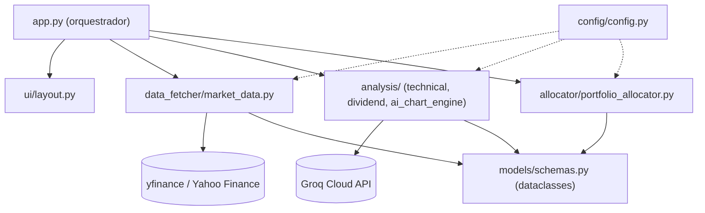
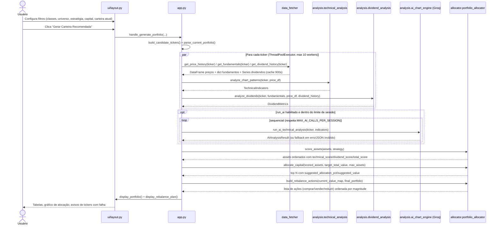

# Especificação Técnica: AI Investment Advisor & Chart Analyst

**Última atualização:** 2026-07-19
**Versão:** 1.0
**Veredito arquitetural:** Desafiado (ver seção 9) — desvio documentado do Clean Architecture padrão do workspace

> Preenchido e mantido pelo agente Architect (`.ai/agents/architect.agent.md`). É o par técnico de `.ai/template.specs` (que é do PM, em linguagem de negócio) — juntos, esses dois arquivos são as únicas duas specs deste kit: **o quê** (requisito do app) e **como** (construção técnica).

## 1. Visão Geral

App Streamlit single-page que coleta dados de mercado (yfinance) para uma lista de tickers BR/US/Cripto, calcula indicadores técnicos e de dividendos, opcionalmente enriquece com interpretação de IA generativa (Groq/Llama 3), pontua e aloca capital entre os ativos elegíveis conforme a estratégia escolhida pelo usuário, e gera um plano de rebalanceamento comparando a carteira atual informada com a carteira alvo sugerida. Uso estritamente educacional — não é recomendação de investimento.

## 2. Diagrama de Arquitetura



Ver detalhamento completo e regras de dependência em `.ai/guidelines/architecture-guidelines.md`.

## 3. Fluxo Principal



## 4. Stack

| Camada | Tecnologia | Versão | Justificativa |
|--------|-----------|--------|---------------|
| Linguagem | Python | 3.11+ | Já em uso; ecossistema de dados/ML maduro (pandas, yfinance) |
| Framework UI | Streamlit | >=1.30,<1.40 | Prototipagem rápida de dashboard de dados sem escrever frontend separado |
| Dados de mercado | yfinance | >=0.2.38,<0.3 | Fonte gratuita, sem necessidade de API key, cobre BR (`.SA`), US e cripto (`-USD`) |
| Análise numérica | pandas | >=2.1,<2.3 | Padrão de fato para manipulação de séries temporais financeiras |
| Indicadores técnicos | pandas-ta | >=0.3.14b0,<0.4 | RSI, MACD, EMA, Bollinger prontos sobre DataFrame pandas |
| Numérico base | numpy | >=1.26,<2.1 | Dependência transitiva de pandas/pandas-ta |
| IA generativa | groq (SDK) | >=0.5,<0.7 | Inferência rápida e gratuita/barata para Llama 3.3 70B, resposta em JSON estruturado |
| Gráficos | plotly | >=5.18,<6 | **Declarado mas não usado** (ver seção 8, risco de débito técnico) — UI atual usa `st.bar_chart` |
| Testes | pytest | >=8,<9 | Padrão Python, já usado em `tests/` |
| Lint/Format | ruff | >=0.6,<0.7 | Lint+format unificados, já configurado |
| Persistência | — | — | Nenhuma. Stateless por request; cache só em memória via `st.cache_data` (TTL 900s) |

## 5. Componentes & Contratos de Interface

| Componente | Responsabilidade | Tecnologia |
|-----------|-----------------|------------|
| `config/config.py` | Configuração global: tickers padrão por classe/mercado, pesos de estratégia, thresholds (RSI, DY mínimo), variáveis de ambiente (`GROQ_API_KEY`, `AI_ACCESS_PASSWORD`, `MAX_AI_CALLS_PER_SESSION`) | Python puro + `os.getenv` |
| `data_fetcher/market_data.py` | Busca preços, fundamentos e histórico de dividendos via yfinance; cache 900s; retry (2 tentativas, backoff 0.3s) | yfinance + `st.cache_data` |
| `analysis/technical_analysis.py` | Calcula RSI, MACD, tendência de EMAs, posição nas Bandas de Bollinger, volatilidade anualizada, suporte/resistência | pandas-ta |
| `analysis/dividend_analysis.py` | Calcula dividend yield normalizado, score 0–1, nota de consistência de pagamento (histórico real), flag de volatilidade | pandas |
| `analysis/ai_chart_engine.py` | Envia indicadores técnicos ao Groq/Llama 3.3, parseia resposta JSON estruturada, com fallback neutro em erro/timeout/JSON inválido | Groq SDK |
| `allocator/portfolio_allocator.py` | Scoring ponderado por estratégia, alocação proporcional de capital entre top-N ativos elegíveis (score > 0.4), geração do plano de rebalanceamento (delta entre carteira atual e alvo) | Python puro |
| `models/schemas.py` | Dataclasses de contrato entre todas as camadas: `TechnicalIndicators`, `AIAnalysisResult`, `DividendMetrics`, `AssetAnalysis` | `dataclasses` |
| `ui/layout.py` | Sidebar de configuração, renderização de tabelas de carteira/rebalanceamento, gráfico de alocação, disclaimer legal | Streamlit |
| `app.py` | Orquestrador: monta lista de tickers candidatos, paraleliza coleta+análise (ThreadPoolExecutor, 10 workers), sequencia chamadas de IA respeitando limite de sessão, aciona scoring/alocação, delega renderização à UI | Python + `concurrent.futures` |

```python
# Contratos de interface entre camadas (models/schemas.py) — usados por QA para escrever mocks

@dataclass
class TechnicalIndicators:
    rsi: float
    macd_signal: str          # "bullish" | "bearish" | "neutral"
    ema_trend: str             # "uptrend" | "downtrend" | "neutral"
    bollinger_position: str    # "upper" | "lower" | "middle"
    volatility: float
    support_levels: List[float]
    resistance_levels: List[float]

@dataclass
class AIAnalysisResult:
    trend: str                 # "Bullish" | "Bearish" | "Neutral"
    short_summary_pt: str
    confidence_score: float    # 0.0 - 1.0
    support_levels: List[float]
    resistance_levels: List[float]

@dataclass
class DividendMetrics:
    dy: float
    dividend_score: float      # 0.0 - 1.0
    stability_note: str        # "Consistente" | "Irregular" | "Histórico insuficiente" | "Regular" | "Indefinida"
    volatility_flag: str       # "low" | "medium" | "high"
    summary_pt: str

@dataclass
class AssetAnalysis:
    ticker: str
    market: str                 # "BR" | "US" | "CRYPTO"
    asset_class: str            # "Ações" | "FIIs" | "ETFs" | "Cripto" | "Desconhecido"
    current_price: float
    technical: Optional[TechnicalIndicators]
    ai_analysis: Optional[AIAnalysisResult]
    dividends: Optional[DividendMetrics]
    technical_score: float = 0.0
    dividend_score: float = 0.0
    total_score: float = 0.0
    recommendation: str = "Aguardar"   # "Compra" | "Venda/Evitar" | "Aguardar"
    reason: str = ""
    suggested_allocation_pct: float = 0.0
    suggested_value: float = 0.0
```

## 6. Dependências Externas

| Sistema | Tipo | Protocolo | Observações |
|--------|------|----------|-------|
| Yahoo Finance (via `yfinance`) | Fonte de dados de mercado | HTTP (scraping/API não-oficial) | Sem SLA, sem API key. Sujeito a rate limit e mudanças de schema sem aviso. Cache 900s + 2 retries mitigam instabilidade transitória |
| Groq Cloud (`groq` SDK) | Inferência de IA generativa | HTTPS REST | Requer `GROQ_API_KEY` (opcional — app funciona sem IA). Limite de `MAX_AI_CALLS_PER_SESSION` (padrão 15) protege custo/quota. Modelo fixo: `llama-3.3-70b-versatile` |

## 7. Modelo de Dados

Não aplicável — o sistema não possui persistência. Todo estado vive em memória durante a execução do script Streamlit (`st.session_state` para contador de chamadas de IA) e em cache TTL (`st.cache_data`, 900s) para respostas de `data_fetcher`. Os dataclasses em `models/schemas.py` (seção 5) são o único "modelo de dados", usados como contrato em memória entre camadas — não mapeiam para tabelas.

## 8. Riscos e Mitigações

| Risco | Severidade | Mitigação |
|-------|-----------|-----------|
| `yfinance` é biblioteca não-oficial que depende de scraping do Yahoo Finance; pode quebrar sem aviso | 🟡 | Cache 900s reduz frequência de chamadas; retry de 2 tentativas; tickers com falha são reportados ao usuário em vez de derrubar a análise inteira (`failed_tickers`) |
| `GROQ_API_KEY` exposta se `.env` for commitado por engano | 🔴 | Chave lida só via `os.getenv`; `.gitignore` deve cobrir `.env` (validar); `AI_ACCESS_PASSWORD` opcional adiciona camada extra antes de gastar quota |
| Ausência de autenticação real — qualquer usuário com acesso à instância pode consumir a quota de IA até `MAX_AI_CALLS_PER_SESSION` | 🟡 | Senha opcional (`AI_ACCESS_PASSWORD`) + limite por sessão. Aceitável para uso educacional/demo, não para produção multiusuário sem revisão |
| `plotly` declarado em `requirements.txt` mas não usado em nenhum módulo (`ui/layout.py` usa `st.bar_chart`) | 🟢 | Débito técnico de baixo impacto — remover da dependência ou decidir adotá-lo para os gráficos existentes numa spec futura |
| Resposta da IA (Groq) pode vir fora do formato JSON esperado | 🟡 | `_parse_ai_response` trata `JSONDecodeError` e campos ausentes com fallback neutro (`_fallback_result`), sem quebrar o pipeline |
| Cálculo de indicadores técnicos exige >= 50 candles; ativos com histórico curto retornam indicadores neutros silenciosos | 🟢 | Comportamento intencional documentado em `analyze_chart_patterns`; considerar expor esse aviso na UI numa spec futura |
| Paralelismo via `ThreadPoolExecutor` (10 workers) sem limite de rate para yfinance | 🟡 | Cache TTL absorve picos de re-execução; se Yahoo Finance começar a bloquear por IP, será necessário backoff mais agressivo ou fila |

## 9. Histórico de Decisões Arquiteturais

### 2026-07-19 — Confirmação da stack existente e desvio documentado do Clean Architecture padrão do workspace
**Contexto:** Primeira execução do agente Architect neste repositório. O projeto já possuía código funcional (app Streamlit de análise de investimentos) construído antes da adoção do devkit-ai, sem que a stack estivesse registrada em `.ai/guidelines/architecture-guidelines.md` (campos `_a definir_`).
**Decisão:** Confirmar a stack já em uso (Python 3.11+, Streamlit, yfinance, pandas/pandas-ta, Groq SDK, pytest, ruff) como referência vinculante em `architecture-guidelines.md`. Documentar oficialmente o desvio do padrão `domain/application/adapters/infra` do workspace: este projeto adota um **Pipeline em Camadas Funcionais** (`data_fetcher → analysis → allocator → ui`, orquestrado por `app.py`), por se tratar de um script Streamlit stateless sem persistência nem autenticação real — caso enquadrado na exceção "CLI ou scripts standalone" da tabela de `architecture-guidelines.md`.
**Alternativas consideradas:** Migrar para Clean Architecture completo (domain/use-cases/adapters/infra) → descartado por adicionar camadas de indireção sem ganho de testabilidade neste contexto (o pipeline atual já é testável via injeção de DataFrame/dict simples, evidenciado pelos testes existentes em `tests/`).
**Trade-offs:** Ganha-se: simplicidade, menor superfície de código, alinhamento com o que já existe e está testado. Perde-se: se o projeto crescer para múltiplos pontos de entrada (API REST, persistência de carteiras de usuário, autenticação real), a estrutura atual precisará ser revisitada e provavelmente migrada para o padrão em camadas do workspace.
**Consequências:** Toda feature futura neste repositório segue a estrutura `config/ → data_fetcher/ → analysis/ → allocator/ → models/ → ui/ → app.py` e as regras de dependência descritas em `architecture-guidelines.md`, em vez do padrão `domain/application/adapters/infra`. Qualquer necessidade futura de persistência ou multiusuário deve reabrir esta decisão com uma nova entrada neste histórico.

## 10. Histórico de Versões

| Versão | Data | Mudança |
|--------|------|---------|
| 1.0 | 2026-07-19 | Criação inicial — baseline técnico a partir do código existente (SPEC-000 Configuração Inicial) |
