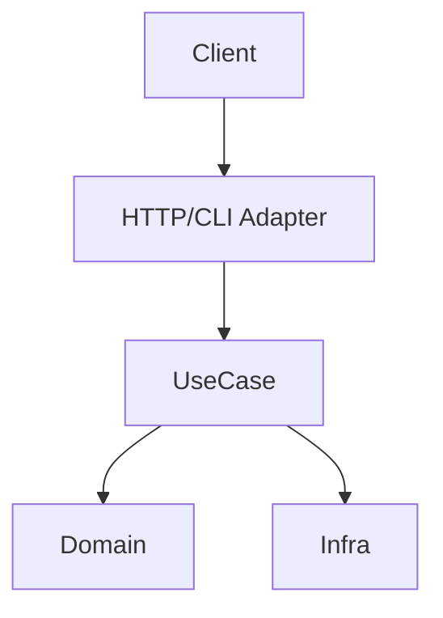
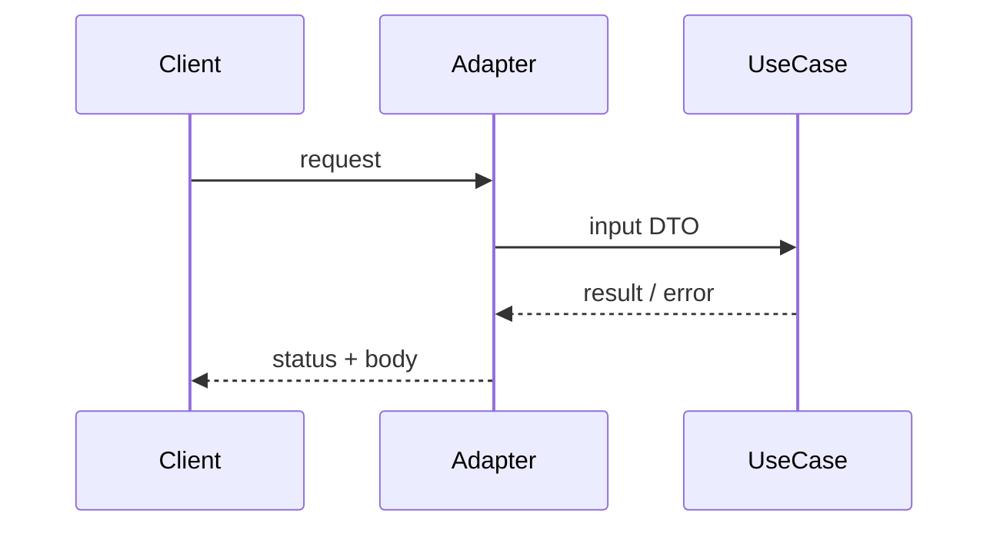

# Especificação Técnica (template): API only

**Última atualização:** AAAA-MM-DD  
**Versão:** 1.0  

> Feature **sem UI** (UX fase = N/A). Foco em contratos, auth, erros e testes.

## 1. Visão Geral

Endpoint(s) / use case(s) para **[capacidade]**.

## 2. Diagrama



## 3. Fluxo



## 4. Stack

| Camada | Tecnologia | Versão | Justificativa |
|--------|-----------|--------|---------------|

## 5. Contratos

| Operação | Input | Output | Erros |
|----------|-------|--------|-------|
| … | … | … | 400 / 401 / 404 / 409 / 500 |

```typescript
// DTOs e códigos de erro estáveis
```

## 6. Dependências externas

| Sistema | Protocolo | Observações |
|--------|----------|-------------|

## 7. Modelo de dados

`erDiagram` ou N/A

## 8. Riscos

| Risco | Severidade | Mitigação |
|-------|-----------|-----------|
| Idempotência | 🟡 | chave de idempotency |
| AuthZ | 🔴 | checar papel no adapter |

## 9. ADR

### AAAA-MM-DD — …
**Contexto:** …  
**Decisão:** …  
