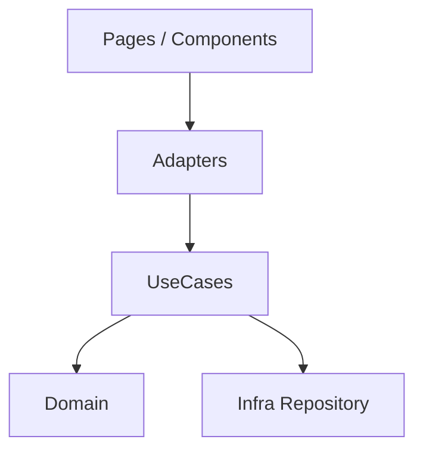
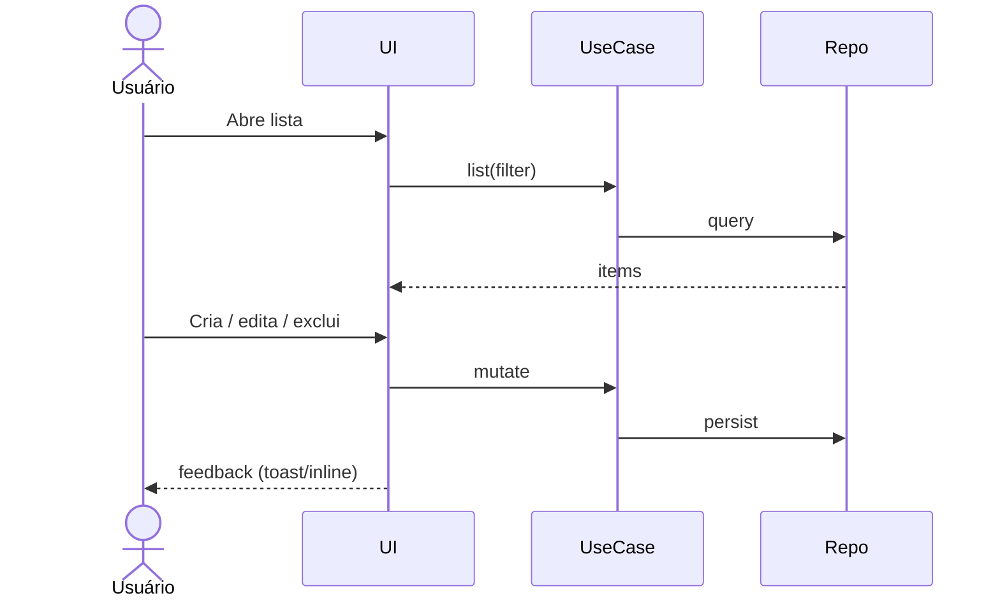
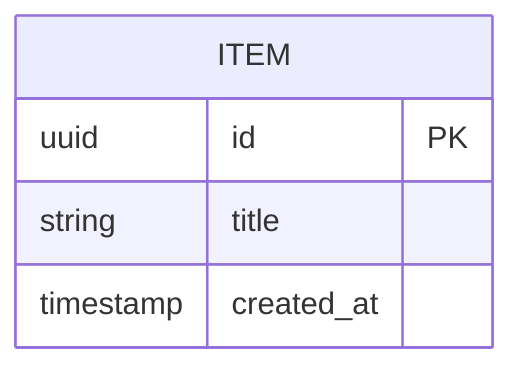

# Especificação Técnica (template): CRUD com UI

**Última atualização:** AAAA-MM-DD  
**Versão:** 1.0  
**Veredito:** Confirmado | Desafiado  

> Use quando a feature for listagem + detalhe + criar/editar/excluir com interface.  
> Baseie-se na §3 UI da spec e em `.ai/guidelines/design-premises.md`.

## 1. Visão Geral

CRUD de **[entidade]** para **[persona]**, com listagem, formulário e exclusão confirmada.

## 2. Diagrama



## 3. Fluxo principal



## 4. Stack

| Camada | Tecnologia | Versão | Justificativa |
|--------|-----------|--------|---------------|
| UI | … | | design-premises |
| API / actions | … | | |
| Persistência | … | | |

## 5. Componentes & contratos

| Componente | Responsabilidade |
|-----------|------------------|
| `ListPage` | filtros, empty, loading, error |
| `FormDialog` ou `FormPage` | create/update + validação |
| `DeleteConfirm` | destrutivo |
| `listX` / `createX` / `updateX` / `deleteX` | use cases |

```typescript
// Exemplo de contrato
type Item = { id: string; title: string; /* … */ }
type ListInput = { q?: string; page?: number }
type ListOutput = { items: Item[]; total: number }
```

## 6. Dependências externas

| Sistema | Tipo | Observações |
|--------|------|-------------|
| … | | |

## 7. Modelo de dados



## 8. Riscos

| Risco | Severidade | Mitigação |
|-------|-----------|-----------|
| Double-submit | 🟡 | disable + idempotency |
| Lista grande | 🟡 | paginação / virtualização |

## 9. ADR

### AAAA-MM-DD — CRUD [entidade]
**Contexto:** …  
**Decisão:** …  
**Alternativas:** …  
**Trade-offs:** …  
**Consequências:** …  
