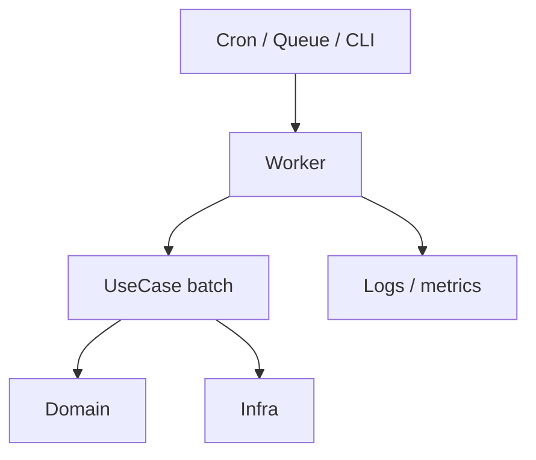
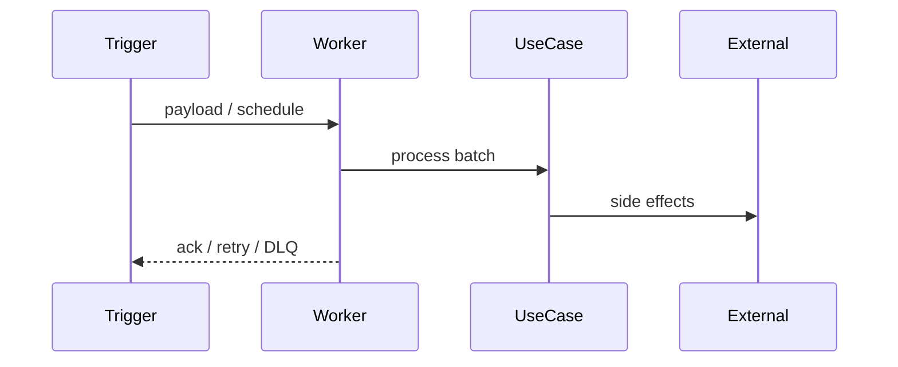

# Especificação Técnica (template): Job / batch / worker

**Última atualização:** AAAA-MM-DD  
**Versão:** 1.0  

> Processamento assíncrono, filas, cron ou worker. UI geralmente N/A (ou só tela de status).

## 1. Visão Geral

Job **[nome]** que processa **[entrada]** e produz **[saída/efeito]**.

## 2. Diagrama

## 3. Fluxo

## 4. Stack

| Camada | Tecnologia | Justificativa |
|--------|-----------|---------------|
| Fila / scheduler | … | |
| Worker runtime | … | |

## 5. Contratos

| Item | Definição |
|------|-----------|
| Payload | schema |
| Retry | política / max attempts |
| DLQ | sim/não |
| Idempotência | chave |
| Timeout | … |
| Observabilidade | logs, métricas, trace |

## 6. Dependências externas

| Sistema | Tipo | Observações |
|--------|------|-------------|

## 7. Modelo de dados

Estado do job / checkpoints se houver.

## 8. Riscos

| Risco | Severidade | Mitigação |
|-------|-----------|-----------|
| Reprocessamento | 🔴 | idempotência |
| Poison message | 🟡 | DLQ + alerta |
| Janela de manutenção | 🟢 | backoff |

## 9. ADR

### AAAA-MM-DD — …
**Contexto:** …  
**Decisão:** …  
