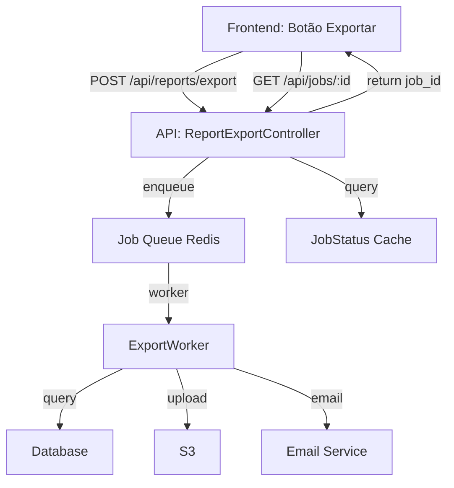
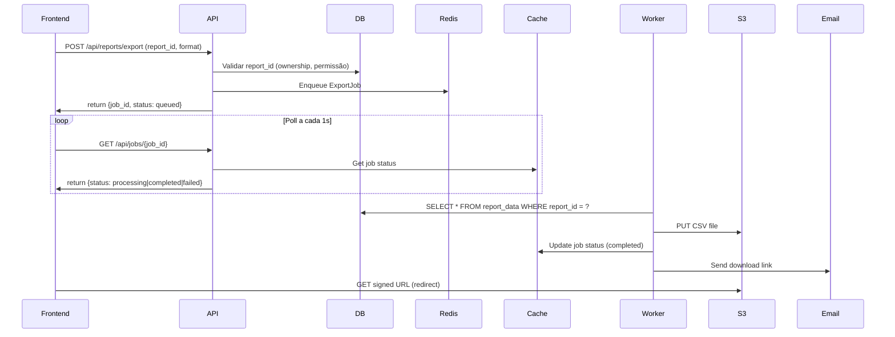

# Technical Spec: [FEATURE-XXX]

**Fase:** `tech_approved` (Architect)  
**Feature Link:** `.ai/specs/FEATURE-XXX.md`  
**Data:** [AAAA-MM-DD]  
**Última Atualização:** [AAAA-MM-DD]

---

## 1. Visão Geral Técnica

[2–4 frases técnicas resumindo o problema e a solução arquitetural]

**Exemplo bom:**
> Esta feature adiciona exportação de relatórios em CSV. A arquitetura usa um job assíncrono que processa a query do usuário, gera o arquivo em S3, e envia um link de download por email. A API de exportação retorna um `job_id` imediatamente; cliente pooling o status até completar.

---

## 2. Diagrama de Arquitetura



---

## 3. Fluxo Principal

### Happy Path



### Fluxo de Erro (timeout > 5 min)

```
Worker inicia
  → Query demora > 5 min (timeout)
  → Worker escreve status: "timeout" em Cache
  → Frontend mostra "Exportação demorou demais"
  → Usuário pode retry (novo job)
```

---

## 4. Stack & Dependências

| Camada | Tecnologia | Versão | Justificativa |
|--------|------------|--------|---------------|
| Frontend | React | 18+ | Padrão projeto |
| API | Node.js / Express | 18 LTS | Padrão projeto |
| Job Queue | Redis | 7.0+ | Async processing; atômico |
| Storage | AWS S3 | (latest) | Escalável; presigned URLs |
| DB | PostgreSQL | 14+ | Reusa padrão |
| Email | SendGrid | (latest) | Reliable; padrão |
| Monitoramento | CloudWatch | (latest) | AWS ecosystem |

---

## 5. Componentes & Contratos

### 5.1 API Contract

**Endpoint:** `POST /api/reports/export`

**Request:**
```json
{
  "report_id": "uuid",
  "format": "csv",
  "email": "user@example.com"
}
```

**Response (201 Created):**
```json
{
  "job_id": "uuid",
  "status": "queued",
  "created_at": "2026-08-07T10:30:00Z"
}
```

**Error (4xx/5xx):**
```json
{
  "error": "REPORT_NOT_FOUND",
  "message": "Report not found or unauthorized",
  "code": 404
}
```

---

**Endpoint:** `GET /api/jobs/:id`

**Response:**
```json
{
  "job_id": "uuid",
  "status": "completed|processing|failed|queued",
  "download_url": "https://s3.amazonaws.com/...",
  "created_at": "2026-08-07T10:30:00Z",
  "completed_at": "2026-08-07T10:35:12Z",
  "error": null // ou { "code": "...", "message": "..." }
}
```

---

### 5.2 Use Case / Domain Service

```typescript
class ExportReportUseCase {
  async execute(userId: string, reportId: string, format: string): Promise<Job> {
    // 1. Validar ownership
    // 2. Validar formato suportado
    // 3. Enqueue job
    // 4. Retornar job_id
  }
}

class ReportExportWorker {
  async process(jobId: string): Promise<void> {
    // 1. Load report config
    // 2. Query data com timeout
    // 3. Generate CSV in-memory
    // 4. Upload to S3
    // 5. Update job status
    // 6. Send email
  }
}
```

### 5.3 UI Components (React)

```typescript
// ExportButton
<ExportButton reportId={uuid} onSuccess={() => setShowStatus(true)} />

// JobStatus Poller
<JobStatusPoller jobId={uuid} onComplete={(url) => downloadFile(url)} />

// Estados esperados:
// - Queued: spinner
// - Processing: spinner + "Gerando arquivo..."
// - Completed: link download + "Pronto!" 
// - Failed: erro + botão "Tentar Novamente"
```

### 5.4 Mocks para Testes (QA)

| Componente | Mock | Comportamento |
|------------|------|-------------|
| Database | Mock Query | Retorna 10k linhas em 100ms |
| S3 | AWS SDK Mock | PUT bem-sucedido em 50ms |
| Email | Mock Transport | Envia "email" em memória |
| Redis | In-Memory Mock | Job queue local |
| Clock | Date.now() Mock | Fixture time constante |

---

## 6. Dependências Externas & Riscos

| Dependência | Risco | Mitigação |
|-------------|-------|-----------|
| AWS S3 timeout | Arquivo muito grande | Limitar CSV a 100MB; chunking se > isso |
| Email delivery falha | Usuário não recebe link | Retry automático; guardar link no job |
| Job worker crash | Job perde estado | Persistent queue (Redis com RDB snapshot) |
| Concurrent exports (mesmo user) | Limitar taxa | Rate limit 5 exports/min por usuário |

---

## 7. Modelo de Dados

### Tabelas Novas

```sql
CREATE TABLE export_jobs (
  id UUID PRIMARY KEY,
  user_id UUID NOT NULL REFERENCES users(id),
  report_id UUID NOT NULL REFERENCES reports(id),
  status VARCHAR(20) NOT NULL,
  format VARCHAR(10) NOT NULL,
  created_at TIMESTAMP NOT NULL,
  completed_at TIMESTAMP,
  error_message TEXT,
  s3_key VARCHAR(500),
  FOREIGN KEY (report_id) REFERENCES reports(id)
);
```

### Cache Schema (Redis)

```
Key: job:<job_id>
Value: {
  status: "queued|processing|completed|failed",
  created_at: timestamp,
  completed_at: timestamp,
  download_url: string,
  error: { code, message }
}
TTL: 7 dias
```

### Estrutura CSV

```
Report ID,Date,User,Amount,Status
UUID,2026-08-07,user@example.com,1500.00,completed
UUID,2026-08-07,user@example.com,2000.00,pending
```

---

## 8. Riscos & Mitigações

| Risco | Severidade | Mitigação |
|-------|----------|-----------|
| **CSV generation memory spike** (100k+ linhas) | Alta | Streaming writer; limitar a 100k por job; se > pedir nova query |
| **S3 endpoint falha** | Alta | Retry com backoff exponencial; fallback para BD temp storage |
| **Email spam filters** | Média | Use SendGrid templates; unsubscribe link |
| **Concurrent deletes (user deleta report enquanto exporta)** | Média | Soft delete; job continua com version snapshot |
| **Rate limiting (1000 requests/sec)** | Baixa | API rate limit 5 jobs/min per user; queue backpressure |

---

## 9. ADRs (Architecture Decision Records)

### ADR-001: Async Job vs. Synchronous Export

**Decisão:** Usar job queue assíncrono (Redis).  
**Por quê:** Sync: bloqueia request > 30s timeout; users frustrados. Async: feedback imediato; escala melhor.  
**Data:** 2026-08-07  
**Status:** Aceito

---

### ADR-002: Storage: S3 vs. Temporary BD Table

**Decisão:** S3 com presigned URLs.  
**Por quê:** S3 escala; presigned URLs seguras; CDN built-in; não congestion BD.  
**Data:** 2026-08-07  
**Status:** Aceito

---

## 10. Versionamento

| Versão | Data | Mudança |
|--------|------|---------|
| 1.0 | 2026-08-07 | Spec inicial |
| — | — | — |

---

## Próximas Fases

**QA (tech_approved → test_red):**
- Escrever testes baseados em §5 contratos
- `.ai/features.feature` atualizado

**Developer (test_red → code_review):**
- Implementar conforme componentes §5
- Respeitar mitigações §8

**QA Validação (code_review):**
- Rodar teste end-to-end
- Validar DoD da spec

---

**Próximo:** Rodapé com aprovações / status gate
