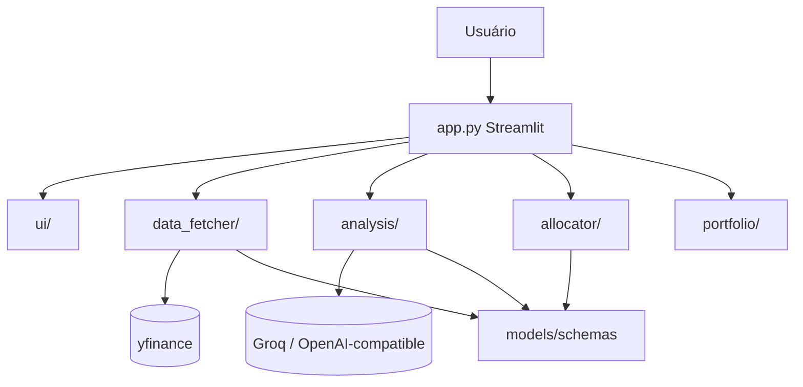

# System Design — AI Investment Advisor & Chart Analyst

> **Arquivo humano do jojo-ai (junto com `agents.md`).**  
> Fonte da verdade de arquitetura e design system **deste** projeto.  
> Backlog humano: `agents.md` → `### Features`.  
> Detalhe histórico e contratos: [`docs/technical-spec.md`](docs/technical-spec.md).

**Última atualização:** 2026-08-07  
**Versão do design:** 1.3  
**Projeto:** AI Investment Advisor & Chart Analyst

---

## 1. Visão de sistema

**Problema que o sistema resolve:**  
Ajudar o usuário a montar e rebalancear uma carteira educacional a partir de tickers BR/US/Cripto, combinando análise técnica, dividendos e interpretação opcional por LLM.

**Limites do sistema (o que está dentro / fora):**  
- Dentro: coleta de mercado, indicadores, score, alocação, rebalance, import/export de carteira, persistência leve de preferências, UI Streamlit  
- Fora: execução de ordens, conta de corretora, multi-tenant autenticado, recomendação regulada, backtest histórico completo

**Atores / sistemas externos:**

| Ator / sistema | Papel |
| --- | --- |
| Usuário final | Configura filtros, capital, carteira; gera e exporta plano |
| Yahoo Finance (via yfinance) | Preços, fundamentos, dividendos |
| Groq / OpenAI-compatible | Interpretação de chart (opcional) |

**Diagrama:**



---

## 2. Arquitetura

### 2.1 Estilo

- [x] Ducks Pattern (domínio/feature em pasta) + monólito Streamlit
- [x] Pipeline orquestrado em `app.py` (fluxo de dados entre ducks)
- [ ] Clean Architecture domain/application/adapters (fora de escopo — ver `docs/technical-spec.md` §9)

**Justificativa:** coesão por feature (ducks) com shared mínimo; script Streamlit stateless sem backend separado.

### 2.2 Camadas / pastas (Ducks)

```
app.py                         # orquestrador Streamlit
ducks/
  market/                      # fetch yfinance (API pública em __init__)
  analysis/                    # técnico, dividendos, AI chart
  portfolio/                   # carteira, alocação, rebalance, prefs, alertas
  llm/                         # providers pluggable
  ui/                          # layout, theme, i18n
shared/
  config/                      # env, tickers, pesos
  models/                      # dataclasses de contrato
  utils/                       # fx, tickers
tests/
docs/
kit/                           # jojo-ai (processo de agentes)
```

**Regra de dependência:**  
- `shared/models` → zero imports de ducks  
- `ducks/market` e `ducks/analysis` → não importam `ducks/ui`  
- `ducks/portfolio` → usa `shared/models` + `shared/config` (recebe `AssetAnalysis` pronto)  
- `ducks/ui` → apresentação Streamlit; pode importar APIs públicas de outros ducks  
- Preferir imports via `__init__.py` (API pública do duck)  
- `app.py` → único orquestrador do pipeline entre ducks  

### 2.3 Stack

| Camada | Tecnologia | Versão | Notas |
| --- | --- | --- | --- |
| Linguagem | Python | 3.11+ | |
| UI | Streamlit | >=1.30 | single-page |
| Mercado | yfinance | >=0.2.38 | sem API key |
| Numérico | pandas / pandas-ta / numpy | | indicadores |
| LLM | groq + openai SDK | | registry em `llm/` |
| Testes | pytest | >=8 | |
| Lint | ruff | | |
| CI | GitHub Actions | | `jojo-review` + pytest |
| Persistência | — | | session_state, cache TTL, prefs leves |

### 2.4 Dados

| Entidade | Dono | Persistência | Observações |
| --- | --- | --- | --- |
| AssetAnalysis e derivados | `models/schemas` | memória | contrato entre camadas |
| Cache mercado | data_fetcher | `st.cache_data` ~900s | |
| Preferências / carteira | portfolio/persistence | query params / arquivo local opcional | sem secrets |
| Contador calls IA | session_state | sessão | `MAX_AI_CALLS_PER_SESSION` |

---

## 3. Design system (UI)

| Token | Valor |
| --- | --- |
| Fundo | `#0f1419` |
| Superfície / sidebar | `#151b23` |
| Borda | `#243041` |
| Texto primário | `#e7ecf1` |
| Texto secundário | `#8b9bb0` |
| Biblioteca | Streamlit + CSS custom (tema escuro) |
| Emojis | mínimos; copy sóbria |

**UX:**  
- Sidebar em seções: Essencial · Carteira · Avançado  
- Empty state em 3 passos  
- Resultados: métricas → carteira → alocação → rebalance → “Como deve ficar” → detalhes (expander)  
- Spinner/progress na geração; feedback de import N válidos / M ignorados  
- Fallback de IA em PT-BR sem quebrar o pipeline  
- Disclaimer educacional sempre visível  

---

## 4. Segurança e privacidade

- Chaves (`GROQ_API_KEY`, `OPENAI_API_KEY`, etc.) e `AI_ACCESS_PASSWORD` só via ambiente  
- Não persistir secrets em query params / CSV export  
- Uso educacional; sem autenticação multi-usuário no MVP  

---

## 5. Qualidade

- Feature nova / bugfix: teste automatizado (skill TDD em `kit/docs/skills/tdd.md`)  
- Review: ruff + pytest nos pacotes do app  
- Processo: **jojo-ai v1.4** — backlog em `agents.md` → `### Features`; fases em Seção 2; kit em `kit/`  
- Histórico de specs: `docs/specs/`; changelog de produto: `docs/CHANGELOG.md`  
- Rastreio de trabalho ativo: `CHANGELOG.md` na raiz  

---

## 6. Fora de escopo / não fazer

- Reintroduzir DevKit (`./devkit`, hooks pre-commit DevKit, CI `devkit-review`)  
- Pedir ao humano arquivos extras de config além de `agents.md` / `system-design.md`  
- Plotly (removido SPEC-009)  
- Lógica de negócio em `ui/`  
- Tratar saída da IA como ordem de compra/venda  
